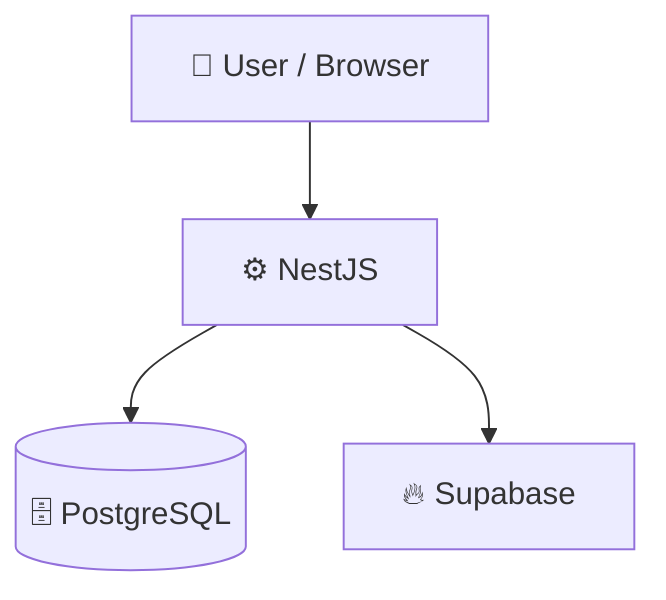

<p align="center">
  <h1 align="center">@myko.pk/atlas</h1>
  <p align="center"><strong>One API. Any Database.</strong></p>
  <p align="center">Unified database abstraction layer for the MYKO ecosystem — Drizzle ORM, Prisma, raw SQL, Supabase, or Mock.</p>
  <p align="center">
    <a href="https://www.npmjs.com/package/@myko.pk/atlas"></a>
    <a href="https://www.npmjs.com/package/@myko.pk/atlas"></a>
    <a href="https://github.com/mykopk/atlas/actions"></a>
    <a href="https://github.com/mykopk/atlas"></a>
    <a href="https://github.com/mykopk/atlas"></a>
    <a href="https://github.com/mykopk/atlas"></a>
    <a href="https://github.com/mykopk/atlas"></a>
    <a href="./LICENSE"></a>
  </p>
</p>

## 📑 Table of Contents

- [Description](#description)
- [Key Features](#key-features)
- [Use Cases](#use-cases)
- [Tech Stack](#tech-stack)
- [Architecture](#architecture)
- [Quick Start](#quick-start)
- [Key Dependencies](#key-dependencies)
- [Available Scripts](#available-scripts)
- [Project Structure](#project-structure)
- [Development Setup](#development-setup)
- [Testing](#testing)
- [Contributors](#contributors)
- [Contributing](#contributing)
- [License](#license)

## 📝 Description

@myko.pk/atlas is a universal database abstraction layer designed for the MYKO ecosystem. It solves the challenge of handling multiple, fragmented database technologies—such as Drizzle ORM, Prisma, raw SQL, and Supabase—across different backend services. By providing a unified API, it standardises database interactions and eliminates duplicate boilerplate code across your services.

## ✨ Key Features

- **🔌 Adapter-Agnostic Core** — Switch seamlessly between Drizzle, Prisma, raw SQL, and Supabase backends via a single unified API configuration.
- **🛡️ Pluggable Middleware Extensions** — Compose non-intrusive extensions for encryption, caching, soft-deletes, auditing, and read/write replicas.
- **🧪 Built-in Mock Adapter** — Test database queries locally and reliably without spinning up active database instances using a dedicated mock client.
- **🦅 NestJS Integration** — Integrate easily into NestJS-based applications with native modules and services designed for the MYKO ecosystem.

## 🎯 Use Cases

- Standardising database interactions across multiple microservices that use different ORMs or direct SQL connections.
- Applying transparent encryption, soft-deletes, and audit logging to database tables without modifying application business logic.
- Simulating database operations in CI/CD pipelines and unit tests using the integrated Mock adapter.
- Scaling applications by implementing read replicas, multi-read, and multi-write database routing configs.

## 🛠️ Tech Stack

- 💧 **Drizzle**
- 🚀 **Express.js**
- 🐘 **PostgreSQL**
- 🟩 **Supabase**
- 📘 **TypeScript**

**Notable libraries:** NestJS, Vitest, Zod

## 🏗️ Architecture



## ⚡ Quick Start

```bash
npm install @myko.pk/atlas
```

```ts
import { createDatabaseService } from "@myko.pk/atlas";

const db = await createDatabaseService({
  adapter: "drizzle",
  config: { connectionString: process.env.DATABASE_URL! },
});

const user = await db.findById("users", "abc-123");
if (user.success) console.log(user.data);
```

## 📦 Key Dependencies

```
@myko.pk/config: ^1.0.0
@myko.pk/errors: ^1.0.0
@myko.pk/logger: ^1.1.0
@myko.pk/types: ^1.0.0
@supabase/supabase-js: ^2.49.4
drizzle-orm: ^0.44.6
pg: ^8.13.3
pino: ^9.6.0
sanitize-html: ^2.17.5
zod: ^4.4.3
```

## 🚀 Available Scripts

- **build** — `npm run build`
- **dev** — `npm run dev`
- **typecheck** — `npm run typecheck`
- **test** — `npm run test`
- **test:watch** — `npm run test:watch`
- **prepublishOnly** — `npm run prepublishOnly`
- **prepack** — `npm run prepack`

## 📁 Project Structure

```
.
├── CHANGELOG.md
├── CONTRIBUTING.md
├── LICENSE
├── SECURITY.md
├── package.json
├── src
│   ├── adapters/
│   │   ├── drizzle/DrizzleAdapter.ts
│   │   ├── prisma/PrismaAdapter.ts
│   │   ├── sql/SQLAdapter.ts
│   │   ├── supabase/SupabaseAdapter.ts
│   │   └── mock/MockAdapter.ts
│   ├── advanced/
│   │   ├── caching/
│   │   ├── connection-pool/
│   │   ├── monitoring/
│   │   ├── multi-tenancy/
│   │   ├── read-replica/
│   │   ├── sharding/
│   │   └── backup/
│   ├── builder/query/
│   ├── extensions/
│   ├── factory/
│   ├── migrations/
│   ├── nestjs/
│   ├── repository/
│   ├── security/
│   ├── seeds/
│   ├── service/
│   └── utils/
├── tsconfig.json
├── tsup.config.mjs
└── vitest.config.ts
```

## 🛠️ Development Setup

1. Install Node.js (v18+ recommended)
2. Install dependencies: `npm install`
3. Start the dev server: `npm run dev`

## 🧪 Testing

This project uses **Vitest** for testing.

```bash
npm run test
```

## 👥 Contributors

<p align="left">
<a href="https://github.com/arsalanwahab" title="arsalanwahab"></a>
</p>

[See the full list of contributors →](https://github.com/mykopk/atlas/graphs/contributors)

## 👥 Contributing

Contributions are welcome! Here's the standard flow:

1. **Fork** the repository
2. **Clone** your fork: `git clone https://github.com/mykopk/atlas.git`
3. **Branch**: `git checkout -b feature/your-feature`
4. **Commit**: `git commit -m 'feat: add some feature'`
5. **Push**: `git push origin feature/your-feature`
6. **Open** a pull request

Please follow the existing code style and include tests for new behavior where applicable.

## 📜 License

This project is licensed under the **MIT** License.

---
Company

MYKO Pakistan

Detail	Information
Website	myko.pk
Email	support@myko.pk
About	Building digital infrastructure and super-app experiences for millions of users across Pakistan.
Built with ❤️ in Pakistan 🇵🇰
